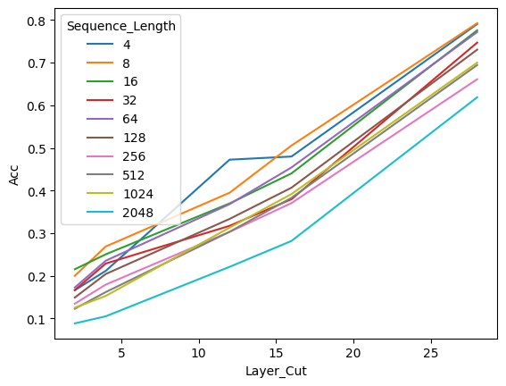

# Fast inference with token merging

This repo hosts codes and materials related to speeding LLMs' generative abilities while preserving quality using token merging.

## Background

Decoder-only Large Language Models are trained using a causal masking process enabling them to learn in a single forward pass to predict the next token based on the previous. When used for different use cases, we generate text by iteratively predict the token, append it to the en d of the sequence and re-run the process. Significant improvements have been made to speed up this (kv cache, quantization...). However, the core procedure remains unchanged and we generate each token one by one. 

## Questionning the need of full sequence length for last token generation

When giving looks at attention masks in different LLMs, we often see that to predict the n-th token, the attention is on average put on the bos token (the first token of the sequence) and the n-th-1 (the last token available). The "middle" context is less used (from what I saw, I can't prove it theoretically), many RAG experiments also support this point with the need of reranking the context properly to generate useful answers.

Keeping full sequence is also a challenge as it impacts strongly the computing power required by the model to process it. Transformers computing needs scale quadratically with the input sequence length, posing major challenges both from a training or generating aspect. 

My question is: to predict accurately the next token regardless of the sequence lentgh, shall we keep the full past tokens or could we merge it ? 

## Merging is the new fashion 

Such proposal has been made in different papers and filed. I personnally looked at this resources:
- Token Merging Stable Diffusion (paper) : https://arxiv.org/abs/2303.17604
- Token Merging Stable Diffusion (library) : https://huggingface.co/docs/diffusers/optimization/tome
- Token Merging NLP (paper) : https://llm-random.github.io/posts/mixture_of_tokens/

TLDR; those papers start with the same assumption and merge the token in the input by averaging or learned representations. 

More recently, the mergekit library showcased the deep power of a relatively unknown merging techniques which is SLERP for Spherical Linear Interpolation. This merging technique is different from the simple average as it interpolates between two vectors by preserving the spherical aspects of their dimensions. 

## Merging sequence using SLERP

The proposed merging procedure is as following:
- The input sequence is:
    - being kept unchanged if its length is inferior to 3
    - being extended by 2 (one null token at the beginning and at the end) if the length is odd
    - being extended by 3 (one null token ath the beginning, at the penultimate position and one at the end) if the length is even
- The new sequence is reformatted in a sequence of pairs of consecutive tokens with a parameter temperature defined appropriately if one of the token is null
- The sequence of pairs is aggregated using a torch version of SLERP

The core idea is to reduce the length of the sequence by a factor of two (not excactly as you get two or three aditional tokens). 

Under is a scheme representing the process of extending the sequence:

Here is a scheme summarizing the global merging procedure:

The merging could occur at different level of the model architecture. One downside is that it strongly relies on the underlying forward pass of the used model, requiring you to carefully rewrite the "merged" process depending on the chosen model. Another downside is the necessity of recomputing attention masks and possibly positional embeddings at each step.

## Results and first comments

I conducted experiments on a Mistral 7B model. My experiments is conducted on 5k texts randomly picked from the CNN daily mail datasets.

I compare top 5 predictions of a base model kept unchanged and several variations of the merged model at inference. Using the huggingface pipeline helps me to easily run variations. I apply it on sequence of different lentghs (4, 8, 16, 32, 64, 128, 256, 512, 1024 and 2048) and apply the merge more or less early in the attention layers' module (referred as layer cut) with a max of 32.

I may have not written it very properly at this stage so the time gain might change as we could re think more broadly the model forward pass if using such merging procedure. 

### Accuracy for the first predicted tokens

The accuracy of the first predicted tokens for the merged and base model grow linearly with the merged layer position. Suprisingly, the accuracy starts at 70% for a layer cut at the 4th attention module.

No pattern in terms of shorter/longer sequence seems to emerge.

### Top 3 accuracy for the first predicted tokens

### Top 5 accuracy for the first predicted tokens

### Intersection for the predicted tokens

### (to be optimized) Estimated time gains

## Limitations and next steps

As I mentionned, this work has been solely conducted on a Mistral 7B model which uses specific techniques (sliding window, RoPe embeddings). This merging idea could differ in terms of implementation depending on the model. 

Also, the merging code might be under-optimized. 

I intend to build a greater version of this technique to build eventually a wrapper class around any Causal LLM in HuggingFace enabling faster inference. 

In the end, I deeply think a dual architecture exists for LLMs: oen for the training and one for the generation.
